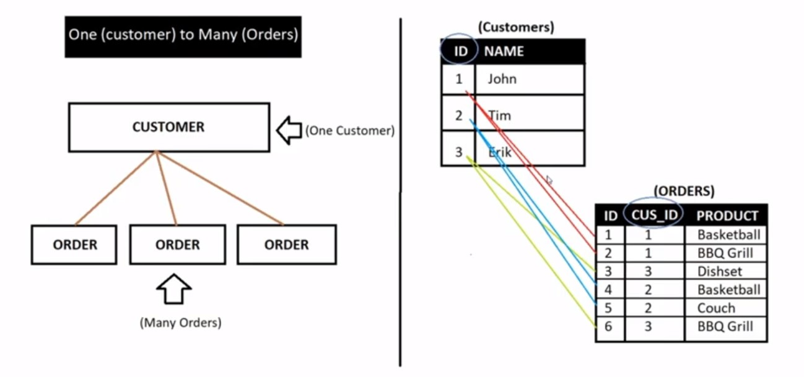
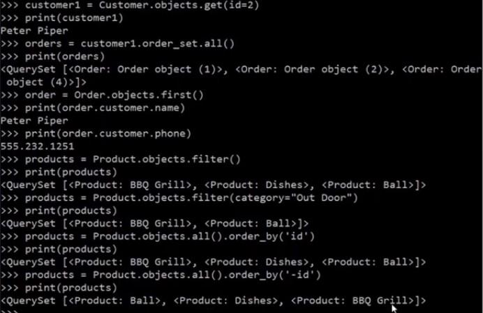

refs: https://www.youtube.com/watch?v=wIPHER2UBB4

## one to many: 


## many to many:


## Code:
```python
from django.db import models

# Create your models here.

class Customer(models.Model):
	name = models.CharField(max_length=200, null=True)
	phone = models.CharField(max_length=200, null=True)
	email = models.CharField(max_length=200, null=True)
	date_created = models.DateTimeField(auto_now_add=True, null=True)


	def __str__(self):
		return self.name


class Tag(models.Model):
	name = models.CharField(max_length=200, null=True)

	def __str__(self):
		return self.name

class Product(models.Model):
	CATEGORY = (
			('Indoor', 'Indoor'),
			('Out Door', 'Out Door'),
			) 

	name = models.CharField(max_length=200, null=True)
	price = models.FloatField(null=True)
	category = models.CharField(max_length=200, null=True, choices=CATEGORY)
	description = models.CharField(max_length=200, null=True, blank=True)
	date_created = models.DateTimeField(auto_now_add=True, null=True)
	tags = models.ManyToManyField(Tag)

	def __str__(self):
		return self.name


class Order(models.Model):
	STATUS = (
			('Pending', 'Pending'),
			('Out for delivery', 'Out for delivery'),
			('Delivered', 'Delivered'),
			)

	customer = models.ForeignKey(Customer, null=True, on_delete= models.SET_NULL)
	product = models.ForeignKey(Product, null=True, on_delete= models.SET_NULL)
	date_created = models.DateTimeField(auto_now_add=True, null=True)
	status = models.CharField(max_length=200, null=True, choices=STATUS)
```

## Queries: 

```python

#***(1)Returns all customers from customer table
customers = Customer.objects.all()

#(2)Returns first customer in table
firstCustomer = Customer.objects.first()

#(3)Returns last customer in table
lastCustomer = Customer.objects.last()

#(4)Returns single customer by name
customerByName = Customer.objects.get(name='Peter Piper')

#***(5)Returns single customer by name
customerById = Customer.objects.get(id=4)

#***(6)Returns all orders related to customer (firstCustomer variable set above)
firstCustomer.order_set.all()

#(7)***Returns orders customer name: (Query parent model values)
order = Order.objects.first() 
parentName = order.customer.name

#(8)***Returns products from products table with value of "Out Door" in category attribute
products = Product.objects.filter(category="Out Door")

#(9)***Order/Sort Objects by id
leastToGreatest = Product.objects.all().order_by('id') 
greatestToLeast = Product.objects.all().order_by('-id') 


#(10) Returns all products with tag of "Sports": (Query Many to Many Fields)
productsFiltered = Product.objects.filter(tags__name="Sports")

'''
(11)Bonus
Q: If the customer has more than 1 ball, how would you reflect it in the database?
A: Because there are many different products and this value changes constantly you would most 
likly not want to store the value in the database but rather just make this a function we can run
each time we load the customers profile
'''

#Returns the total count for number of time a "Ball" was ordered by the first customer
ballOrders = firstCustomer.order_set.filter(product__name="Ball").count()

#Returns total count for each product orderd
allOrders = {}

for order in firstCustomer.order_set.all():
	if order.product.name in allOrders:
		allOrders[order.product.name] += 1
	else:
		allOrders[order.product.name] = 1

#Returns: allOrders: {'Ball': 2, 'BBQ Grill': 1}


#RELATED SET EXAMPLE
class ParentModel(models.Model):
	name = models.CharField(max_length=200, null=True)

class ChildModel(models.Model):
	parent = models.ForeignKey(Customer)
	name = models.CharField(max_length=200, null=True)

parent = ParentModel.objects.first()
#Returns all child models related to parent
parent.childmodel_set.all()

```

## One to many query:

